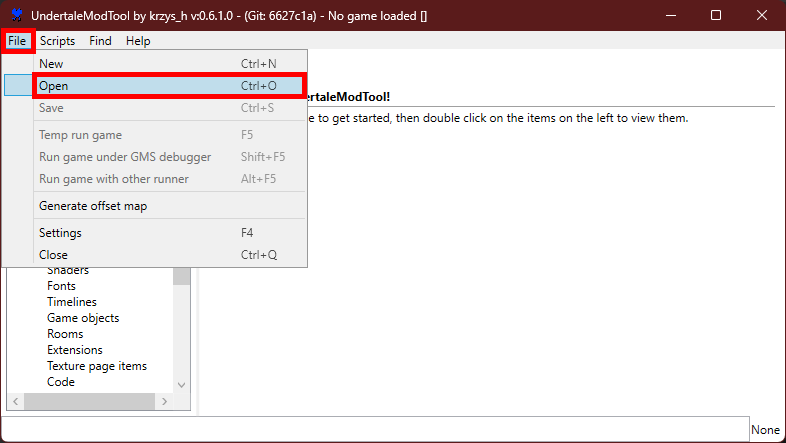

# Русификатор для Fishing The Abyss

**Содержание:**

* [Описание](#описание)
* [Установка русификатора](#установка-русификатора)
* [Удаление русификатора](#удаление-русификатора)
* [Как сделать перевод самостоятельно](#как-сделать-перевод-самостоятельно)

## Описание

Несмотря на то, что в игре присутствует русский язык, этот перевод машинный, некачественный. В большинстве случаев текст написан «не по-человечески» и выходит за границы во многих элементах интерфейса. Данный русификатор предоставляет качественный перевод игры, решающий эти проблемы.

> [!IMPORTANT]
> Очень важно, чтобы игра была той же версии, для которой предназначен русификатор. Посмотреть версию игры вы можете в **левом верхнем углу главного меню игры**. Версия игры, для которой предназначен русификатор, указана **в заголовке и описании релиза**.

Если для скачивания доступен только русификатор для старой версии игры, то либо дождитесь нового релиза, либо воспользуйтесь моими наработками для создания своего.

## Установка русификатора

1. **Скачайте последнюю версию русификатора**. По [данной ссылке](https://github.com/QuickStopFire/FishingTheAbyss-RU-Translation/releases/latest) скачайте файл «data.win». Обязательно проверьте, для какой версии игры предназначен русификатор.

    

2. **Окройте папку с файлами игры**. В библиотеке Steam кликните правой кнопкой мыши по игре и выберите «Управление — Просмотреть локальные файлы»

    

3. **Замените файл**. В открывшуюся папку поместите ранее скачанный файл «data.win» с заменой.

## Удаление русификатора

1. В библиотеке Steam кликните правой кнопкой мыши по игре и выберите «Свойства...».

    

2. В открывшемся окне перейдите во вкладку «Установленные файлы» и нажмите на кнопку «Проверить целостность файлов игры». После проверки Steam заново скачает файл «data.win» и игра вернётся в исходное состояние, до установки русификатора.

    

## Как сделать перевод самостоятельно

Перевод можно сдеалать самому, отредактировав оригинальный файл «data.win». Для этого следуйте пунктам ниже.

1. **Скачайте UndertaleModTool**. Не смотря на название, данную программу можно использовать для модификации любой игры, сделанной на движке GameMaker. Скачать её можно с [официального репозитория](https://github.com/UnderminersTeam/UndertaleModTool/releases/latest) автора программы.

    

2. **Откройте файл в программе**. Распакуйте фалы из скачанного архива в удобное вам место. После запуска «UndertaleModTool.exe» откроется программа, где в меню сверху нажмите «File — Open». Откроется окно проводника, где нужно открыть файл «data.win» (По-умолчанию расположен в папке «C:\Program Files (x86)\Steam\steamapps\common\Fishing_The_Abyss»)

    

    Если при открытии файла возникает ошибка «Failed to find reference...», необходимо [докачать некоторые файлы](https://github.com/UnderminersTeam/UndertaleModTool/pull/980) к программе. Выберите «GUI-windows-latest-isBundled-false-isSingleFile-true» и файлы из скачанного архива распакуйте в папку программы с заменой.

    

3. **Непосредственно перевод**. В строку поиска введите «gml_GlobalScript_scr_Lunguage» и откройте файл с соответсвующим названием во вкладке «Code». В области справа появится код, который отвечает за локализацию текста в игре. Вы можете внести любые изменения в этот код.

    

4. **Сохраните изменения**. После того, как вы закончили редактирование, сохраните файл (Ctrl + S).

## Демонстрация перевода

